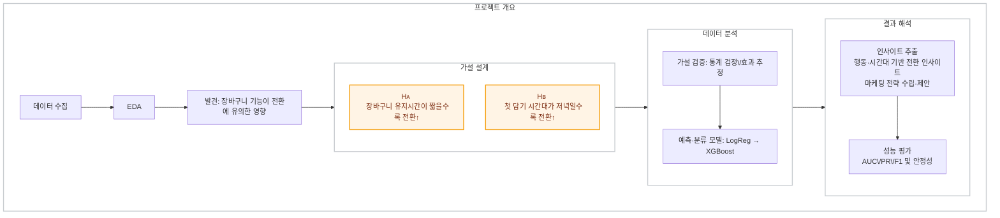

## Contents

1. [소개](#안녕하세요-데이터-분석가-고성빈입니다)
2. [경력](#경력)
3. [핵심 역량 및 보유 기술](#보유-기술)
4. [프로젝트 및 활동](#프로젝트-및-활동)
5. [자격](#자격)
6. [개인 공부](#개인-공부)

---

### 📈 작은 것도 다시보고, 모르는 건 끝까지 파고들겠습니다.
## 안녕하세요, 데이터 분석가 고성빈입니다.
>[](https://www.notion.so/o-17589b3f2b2d80e389f7c5ad9ffb55d5?source=copy_link)
[](https://velog.io/@tjdqls3324/posts)
[](https://github.com/sbinhigher)
>
> [](mailto:sbinhigher@naver.com)
[](https://www.linkedin.com/in/sbinhigher)
### 간략 소개
```
저의 깃허브에 방문해주셔서 감사합니다.

안녕하세요, 데이터 프로젝트 운영하고 리드한 경험이 있는 데이터 분석가 고성빈입니다.
풍력발전기, 교통, 관광 등 다양한 도메인에서 데이터 분석과 이미지 객체 탐지 프로젝트를 수행했습니다.
분석 과정에서 도메인 이해와 KPI 기반의 문제 정의가 성과에 미치는 영향을 체감하며, SQL 역량 강화와 비즈니스 KPI 도출 및 개선 방향 설계에 깊은 관심을 갖고 학습 중입니다.
작은 것도 다시 보고, 모르는 건 끝까지 파고드는 태도로 실질적인 가치를 만드는 데이터 분석가가 되겠습니다.
```
<br>

### 핵심 역량
#### 1️⃣ Python을 활용한 데이터 탐색(EDA), 데이터 정제, 데이터 분석, 시각화 역량
- 이미지 객체 탐지 프로젝트 수행 중 메타 데이터 추출, json2txt 변환, 이미지 리사이징 등 **데이터 핸들링** 숙련도 향상
- 제주도 내 교통 위험도 예측 프로젝트를 통해서 RandomForest, LightGBM 등 **ML 모델링** 경험 보유
- 관광 변화 추이 분석 프로젝트를 통해서 텍스트 크롤링, SNA, 감성분석 등 **비정형 데이터 분석 및 시각화 역량** 보유
- 카드 데이터 및 외식업 pos 데이터 기반 프로젝트 및 교통 위험도 프로젝트 수행 시 **EDA, 데이터 정제, 데이터 시각화(matplotlib, seaborn 등), 시각화 툴(Tableau)** 사용 역량 보유
#### 2️⃣ SQL을 활용한 데이터 추출 및 KPI 지표 산출 역량
- **PostgreSQL**을 활용하여 교통 위험도 프로젝트에서 실제 데이터를 추출하고 분석한 경험 보유  
- Programmers, LeetCode 등에서 **MySQL 기반 중급 이상의 SQL 코딩 테스트 역량** 보유  
- Olist 데이터셋을 기반으로 고객 이탈률, 재구매율 등 **비즈니스 KPI 지표**를 산출하며 실무 분석 역량 강화
#### 3️⃣ 협업 및 커뮤니케이션 역량
- **B2B 프로젝트** (이미지 객체 탐지, 스티칭 등)에서 외부 인력과의 기술 협업 경험  
- **B2G 사업**(교통 위험도 분석)에서 경찰청, 지자체 등과의 커뮤니케이션을 통해 요구사항 조율 및 성과 도출  
- **솔루션 개발 프로젝트**에서 웹 개발자·DB 관리자와의 협업을 통해 **데이터 파이프라인 구축**
---

## 경력

#### [데이터 분석가] (주)골든플래닛  
| 기간              | 형태   | 직급    | 소속             |
|------------------|--------|---------|------------------|
| 2022.11 – 2024.11 | 정규직 | 주니어 | 데이터 분석 1팀 |

##### 📌 주요 프로젝트

- **풍력발전기 블레이드 결함 탐지 솔루션 개발**  
  ⏱ *2022.11 – 2024.06*  
  🔗 [프로젝트 자세히 보기](#1️⃣-프로젝트풍력발전기-블레이드-결함-탐지-솔루션-개발)

- **제주도 내 도로 위험도 예측을 통한 치안 공백 해소 프로젝트**  
  ⏱ *2023.05 – 2024.11*  
  🔗 [프로젝트 자세히 보기](#2️⃣-프로젝트제주도-내-도로-위험도-예측을-통한-치안-공백-해소-프로젝트)
- **렌터카 차량 데미지 탐지 솔루션 개발**  
  ⏱ *2024.01 – 2024.11*  

- **화재현장 자동 이미지 분류 및 스티칭 시스템 구축**  
  ⏱ *2024.07 – 2024.10*  
<br> 

#### [연구원] (재)제주테크노파크  
| 기간              | 형태      | 직급     | 소속           |
|------------------|-----------|----------|----------------|
| 2022.07 – 2022.08 | 파트타임  | 연구원   | 빅데이터사업부 |

##### 📌 주요 프로젝트

- **카드 데이터 및 외식업 POS 데이터 기반 읍면동 시각화**  
  ⏱ *2022.07 – 2022.08*  

- **제주 특산물 관련 텍스트 기반 비정형 데이터 분석**  
  ⏱ *2022.07 – 2022.08*  

<br>

#### [연구원] (재)제주테크노파크  
| 기간              | 형태   | 직급   | 소속           |
|------------------|--------|--------|----------------|
| 2021.09 – 2022.02 | 인턴   | 연구원 | 빅데이터사업부 |

##### 📌 주요 프로젝트

- **농수산물 입찰 데이터 전처리 및 시각화**  
  ⏱ *2021.09 – 2021.10*  

- **제주 특산물 관련 텍스트 기반 비정형 데이터 분석**  
  ⏱ *2021.11 – 2022.02*  

---

## 보유 기술

### 🖥️ Languages & Environment
> 

>>#### Data Handling & Preprocessing
>>


>>
>>#### Data Crawling
>>

>>
>>#### Image Processing
>>


>
> 


### 💾 Database & Querying
> 


### 📊 Visualization & Tool
>
>> #### Libraries
>>


>
>
>
>
### 🛠️ Team Collaboration Tool
> 


---
## 프로젝트 및 활동

### 1️⃣ [프로젝트]**이커머스 데이터를 통한 장바구니 고객 행동 분석**
| 항목             | 내용                                                                 |
|------------------|----------------------------------------------------------------------|
| 프로젝트 기간     | 2025.09 – 2025.12                                                    |
| 참여 인원        | 3명                                                                   |
#### 🔍 프로젝트 분류  
`이커머스 데이터 분석(E-commerce Analytics)` · `전환율 예측(Conversion Prediction)` · `행동로그 분석(Behavior Analytics)`




#### 역할  
- 분석 설계 총괄: **가설(H1/H2) 수립 → 피처 엔지니어링 → 모델링 → 해석**  
- 실험 프레임 구축: **교차 검증** 및 **변수 중요도 vs 통계검정 결과** 정합성 점검  
- 데이터 품질·불균형 대응(언더/오버샘플링) 및 **지표체계(AUC/PR/F1)** 운용

#### 프로젝트 배경
- 장바구니 이탈이 높고, **룰 기반 타깃팅**만으로는 마케팅 효율 한계  
- 유저의 **담기 시간대/유지시간** 같은 행동 특성에 따라 전환률이 크게 달라질 수 있으나, 이를 정량 검증·예측하는 체계 부재

#### 문제 해결 방법
1. **가설 정립**:  
   - H1: 장바구니 **유지시간(`cart_duration`)** 이 짧을수록 전환↑  
   - H2: 장바구니 **첫 담기 시간대(`hour_first`)** 가 **저녁(18–22시)** 일수록 전환↑
2. **피처 엔지니어링(파생변수 생성)**: </br> `cart_duration`, `hour_first`, `weekday_first`, `view_count`, `cart_count`, `price_mean`, `category_main_freq`, `cart_to_view_ratio`, `session_duration_min`
3. **모델링(분류)**: 베이스라인 **Logistic Regression** → 보완모델 **XGBoost** 후보군 구성(세션 단위 전환 확률)  
4. **데이터 불균형 대응**: 언더/오버 샘플링, **train/test=70:30** 분할  
5. **교차 검증·해석**: 통계 검정 결과와 **변수 중요도(설명가능성)** 일치 여부로 가설 보강  
6. **운영 적용 설계**: 전환확률 스코어 기반 **캠페인/쿠폰 우선순위** 및 시간대별 캠페인 캘린더

#### 🚀 목표 및 성과 *(현 단계 기준)*  
| 항목 | 기존 | 개선 | 성과 |
|---|---|---|---|
| 타깃팅 전략 | 룰/일괄 캠페인 | **전환확률 기반 세그먼트** | 전환확률 스코어 산출 파이프라인 설계·구현 |
| 지표 관리 | 단일 정확도 중심 | **AUC, Precision/Recall, F1** 동시관리 | 전환/비전환 구분력 평가 지침 정립 |
| 가설 검증 | 정성적 추정 | **H1/H2 통계검정 + 모델 중요도 교차검증** | 분석 프레임 완성(일관성 체크 루틴) |
| 설명가능성 | 제한적 | **변수 중요도(예: 로지스틱 계수/트리계열 중요도)** | 마케팅 액션의 근거자료 확보(해석 리포트 템플릿) |

#### 데이터·피처(요약)
- **타깃**: 세션 단위 **구매 여부(1/0)**  
- **핵심 피처**: `cart_duration`(담기~구매/세션종료), `hour_first`(첫 이벤트 시), `cart_to_view_ratio` 등 행동·시간·상품 특성 피처 다층 설계

#### 모델·평가 체계
- **모델 후보**: Logistic Regression(베이스라인), XGBoost(비선형 보완)  
- **데이터셋**: train/test=70:30, 불균형 대응(under/over sampling)  
- **지표**: Accuracy(불균형 주의), **AUC(ROC)**, **Precision/Recall**, **F1**로 다면 평가(0.8 이상의 AUC를 실무 신뢰기준으로 채택)

#### Pain Point & 개선 방안
- **불균형 클래스** → PR 곡선·리프트/게인 차트 병행, 샘플링 및 임계값 튜닝  
- **시간 의존성/리크 위험** → 피처 생성 시 **사후 정보(미래 시점)** 유입 차단 규칙 명문화  
- **설명가능성 강화** → 계수 해석(로지스틱) + 트리계열 중요도/Partial Dependence로 교차 점검

#### 🛠️ 사용기술 및 툴(tool)

<p>
  
  
  
  
  
  
</p>


<!--
#### 🚀 목표 및 성과
| 항목 | 기존 | 개선 | 성과 |
|------|-----------|------------|------|
| ⏱️ 진단 소요 시간 | 이미지당 평균 96.42초 | 이미지당 평균 5.99초 | **진단 시간 93.8% 단축** |
| 📏 위험도 기준 | 주관적・불일치 기준 | 정량 기준 수립 | **표준화된 위험도 분류체계 확립** |
| 🎯 진단 정확도 | 측정 불가 | Ground Truth 기반 평가 | **재현율(Recall) 0.9 달성** |
#### 🛠️ 사용기술 및 툴(tool)


#### 📌 Pain Point & 개선 방안
> 
 ##### Pain Point 1: 대용량 고해상도 이미지 데이터 처리 어려움
 - 48MP 고해상도 이미지로 인해 데이터 처리 및 저장이 무거웠음  
 - 라벨링 작업에 소요되는 시간과 검수 부담이 큼

>  **해결 방법**  
>  - 최적화된 이미지 리사이징(리사이징 크기 선정을 위한 실험 설계)로 데이터 경량화  
>  - Instance Segmentation 방식 채택으로 결함 특성 세분화
>  - 외부 인력과 엔지니어의 3회 검수 및 피드백 체계 구축

##### Pain Point 2: 일부 결함 신뢰도 저하 및 결함 예측 데이터 부재
- 같은 카테고리의 단발성, 다발성 결함 탐지 시 신뢰도가 낮음  
- SCADA 로그 데이터 권한 문제로 결함 발생 예측에 어려움 존재

> **해결 방법**  
> - 같은 카테고리 내 범위를 기준으로 카테고리 구분  
> - SCADA 데이터 협조 불가에 따라 이미지 기반 탐지 솔루션 고도화에 집중  
> - YOLOv7-seg 모델 기반 하이퍼파라미터 튜닝 및 이미지 증강 적용

##### Pain Point 3: 비라벨링 이미지 데이터 활용 및 데이터 분할 문제
 - 라벨링 되지 않은 이미지 데이터의 활용 방안 마련 필요  
 - 효율적인 Train-Validation-Test 데이터셋 분할 필요

> **해결 방법**  
> - 비라벨링 이미지셋에서 20% 샘플링 활용해 모델 성능 개선 시도  
> - 각 호기 및 파트별로 균등하게 샘플링하여 데이터셋 분할 (8:1.5:0.5)
---
-->
### 2️⃣ [프로젝트]**풍력발전기 블레이드 결함 탐지 솔루션 개발**


| 항목             | 내용                                                                 |
|------------------|----------------------------------------------------------------------|
| 프로젝트 기간     | 2022.11 – 2024.06                                                    |
| 참여 인원        | 4명                                                                   |

#### 🔍 프로젝트 분류  
`이미지 처리(Image Processing)` · `이미지 객체 탐지(Object Detection)` · `데이터 라벨링(Data Labeling)`
#### 역할  
- 이미지 객체 탐지 모델링 및 프로젝트 매니징 총괄  
- 현장성과 정확도를 모두 반영한 진단 기준 수립 주도
#### 프로젝트 배경
- 드론으로 촬영된 블레이드 이미지를 **전사 수작업 검수**하느라 시간이 과도하게 소요됨  
- **엔지니어별 결함 판단 기준 상이**로 인해 검사 정확도와 신뢰도에 문제 발생
#### 문제 해결 방법
1. **결함 유형 및 위험도 레벨에 대한 기준 정립**  
2. **자율주행 드론**을 활용해 블레이드 전면 이미지 수집  
3. 이미지 기반 **객체 탐지 모델(YOLOv7)** 구축으로 자동 진단 시스템화  
4. Ground Truth를 기반으로 한 평가체계로 진단 정확도 정량화
#### 🚀 목표 및 성과
| 항목 | 기존 | 개선 | 성과 |
|------|-----------|------------|------|
| ⏱️ 진단 소요 시간 | 이미지당 평균 96.42초 | 이미지당 평균 5.99초 | **진단 시간 93.8% 단축** |
| 📏 위험도 기준 | 주관적・불일치 기준 | 정량 기준 수립 | **표준화된 위험도 분류체계 확립** |
| 🎯 진단 정확도 | 측정 불가 | Ground Truth 기반 평가 | **재현율(Recall) 0.9 달성** |
#### 🛠️ 사용기술 및 툴(tool)

<p>
  
  
<a href="https://github.com/WongKinYiu/yolov7">
  
</a>
  
  
  
</p>

#### 📌 Pain Point & 개선 방안
> 
 ##### Pain Point 1: 대용량 고해상도 이미지 데이터 처리 어려움
 - 48MP 고해상도 이미지로 인해 데이터 처리 및 저장이 무거웠음  
 - 라벨링 작업에 소요되는 시간과 검수 부담이 큼

>  **해결 방법**  
>  - 최적화된 이미지 리사이징(리사이징 크기 선정을 위한 실험 설계)로 데이터 경량화  
>  - Instance Segmentation 방식 채택으로 결함 특성 세분화
>  - 외부 인력과 엔지니어의 3회 검수 및 피드백 체계 구축

##### Pain Point 2: 일부 결함 신뢰도 저하 및 결함 예측 데이터 부재
- 같은 카테고리의 단발성, 다발성 결함 탐지 시 신뢰도가 낮음  
- SCADA 로그 데이터 권한 문제로 결함 발생 예측에 어려움 존재

> **해결 방법**  
> - 같은 카테고리 내 범위를 기준으로 카테고리 구분  
> - SCADA 데이터 협조 불가에 따라 이미지 기반 탐지 솔루션 고도화에 집중  
> - YOLOv7-seg 모델 기반 하이퍼파라미터 튜닝 및 이미지 증강 적용

##### Pain Point 3: 비라벨링 이미지 데이터 활용 및 데이터 분할 문제
 - 라벨링 되지 않은 이미지 데이터의 활용 방안 마련 필요  
 - 효율적인 Train-Validation-Test 데이터셋 분할 필요

> **해결 방법**  
> - 비라벨링 이미지셋에서 20% 샘플링 활용해 모델 성능 개선 시도  
> - 각 호기 및 파트별로 균등하게 샘플링하여 데이터셋 분할 (8:1.5:0.5)
---
### 3️⃣ [프로젝트]**제주도 내 도로 위험도 예측을 통한 치안 공백 해소 프로젝트**  
| 항목             | 내용                                                                 |
|------------------|----------------------------------------------------------------------|
| 프로젝트 기간     | 2023.05 – 2024.11                                                   |
| 참여 인원        | 4명                                                                   |

#### 🔍 프로젝트 분류  
`탐색적 분석(EDA)` · `ML 모델링(ML Modeling)` · `데이터 핸들링(Data Handling)`

#### 역할  
- 도로통제 예측 알고리즘 개발 및 데이터 분석 전반 주도  
- 관할 기관과 협의하며 데이터 정의 및 수집 프로세스 설계 주도

#### 프로젝트 배경

- 폭설 예보 시 **중산간도로 통제를 위해 경찰 인력의 약 40% 투입**, 이로 인한 타 지역 치안 공백 발생  
- **도로 통제 요인에 대한 실시간 예측체계 미흡**, 경찰 자원 비효율적 운용 문제


#### 문제 해결 방법

1. 제주도 산간도로의 **노면 상태 및 기상 정보 수집 체계 구축**
2. **도로 통제 발생 이력** 및 **노면기상정보** 기반의 예측모델 설계
3. **LightGBM 기반 회귀모델**의 예측값으로 위험도 5단계 구간화하여 표출
4. 4. 도로 위험도를 **1시간 단위로 예측**하여 경찰 대응 결정 지원

#### 🚀 목표 및 성과

| 항목 | 기존 | 개선 | 성과 |
|------|-----------|------------|------|
| ⏱️ 통제 대응 속도 | 수작업 기반, 실시간 예측 불가 | 1시간 단위 도로 통제 예측 지수 산출 | **경찰 출동 사전 의사결정 체계 확보** |
| 📏 대응 기준 | 도로 상황 판단의 주관성 | 기상 및 노면정보 기반 정량 지표 | **표준화된 위험 예측 기반 대응** |
| 📊 위험도 분류 정확도 <br> R1-score | 0.8 이상 목표 | 파생변수 생성 및 하이퍼파라미터 튜닝 | **F1-score 0.88 달성**  |


#### 🛠️ 사용기술 및 툴

<p>
  
  
  
  
  
  
</p>


#### 📌 Pain Point & 개선 방안

##### Pain Point 1: 도로 통제 이력 데이터 부족 및 비정형성
- 대부분의 도로통제 기록은 **문서 및 이미지 형태**로 수기 작성됨
- **일관된 데이터 구조 부족**으로 머신러닝 모델 학습에 제약 발생

> **해결 방법**
> - 도청 제공 이미지 및 한글 파일 **크롤링 자동화**
> - 텍스트 추출 및 정형 데이터 변환 자동화 적용
> - 신규 문서 자동 반영을 위한 **데이터 수집 파이프라인 구축**


##### Pain Point 2: 데이터 불균형으로 인한 예측모델 성능 저하
- 결빙/폭설에 따른 도로 통제 데이터 수가 현저히 적음
- 통제 없음 상황에 비해 예측 정확도 저조

> **해결 방법**
> - **데이터 오버샘플링** 및 클래스 균형 보정
> - 도로 위험도 구간화를 통한 **다중 분류 방식** 적용
> - LightGBM 회귀모델에서 **통제 지수 예측 후 구간화**


##### Pain Point 3: 기상 정보 결측 및 센서 데이터 미수집 항목 존재
- 적설량/결빙량 등 핵심 변수는 프로젝트 초기 수집되지 않음
- 일부 노면기상 센서 미작동 이슈 존재

**해결 방법**
> - 기상청 및 도청 협조로 **2차 데이터 수집**
> - 적설량/결빙량 포함한 **보완 통제 이력 데이터 확보**

##### Pain Point 4: 예측값의 직관성 부족으로 사용자 이해도 저하  
- 예측 모델이 산출한 **위험도 지표(0~1 사이의 확률값)** 가 사용자 및 사업 담당자에게 **직관적으로 해석되기 어려움**  
- 실제 활용 시 **의사결정 기준으로 사용되기 어려움**

> **해결 방법**  
> - 예측된 위험도 지표를 **1~5단계 구간으로 등급화**하여, **분류 모델처럼 직관적으로 표현**  
> - 사용자 인터페이스에 **등급별 색상 또는 라벨을 시각화하여 가독성 개선**  
> - 이를 통해 **정책 결정 및 현장 대응 판단에 실질적 도움 제공**

---

### 4️⃣ [학술 활동] 『COVID 19로 인한 제주 관광의 변화 추이 분석 - 빅데이터 분석을 중심으로 -』 논문 집필
| 항목     | 내용                                      |
|---------|-------------------------------------------|
| 활동 기간 | 2021.12-2022.06                   |
| 역할     | 데이터 분석(제1저자)           |
| 소속     | 제주대학교            |
| 🔗 KCI 원문  | [KCI](https://www.kci.go.kr/kciportal/ci/sereArticleSearch/ciSereArtiView.kci?sereArticleSearchBean.artiId=ART002851856)           |

#### 📊 성과 및 영향력

| 지표            | 수치    |
|-----------------|---------|
| 국내 피인용 횟수 | 16회    |
| FWCI            | 5.23(2025-08-04 기준)    |
| KCI 열람 수     | 978회   |
#### 📌 논문 개요
```
코로나19 팬데믹이 제주 관광 산업에 미친 영향을 빅데이터를 활용해 분석한 연구입니다.  
SNS 및 블로그 등 온라인 관광 관련 텍스트 데이터를 수집·분석하여, 팬데믹 전후 관광객의 여행 방식과 관심사 변화를 실증적으로 파악하였습니다.  
이를 통해 제주 관광 정책 및 마케팅 전략 수립에 필요한 데이터 기반 인사이트를 제공하였습니다.
```
#### 🔍 분석 내용 및 방법론  
- **데이터 수집:** 네이버 블로그 등에서 코로나19 이전·이후 제주 관광 관련 게시글 수집
- **텍스트 마이닝:** 자연어 처리로 의미 있는 키워드 추출 및 빈도 분석  
- **네트워크 분석:** 키워드 간 관계망 시각화 및 중심성 분석으로 핵심 트렌드 도출  
- **비교 분석:** 팬데믹 전후 키워드 및 트렌드 변화를 비교하여 관광 패턴 변화 확인

#### 🛠️ 사용기술 및 툴(tool)

<p>
  
  
  
  
  
</p>

#### 💡 시사점  
- 사회적 거리두기 및 안전 우려가 지속가능한 분산 관광 수요 증가로 연결  
- 데이터 기반 실시간 관광객 수요 모니터링과 맞춤형 관광 상품 개발 필요  
- 친환경·자연 친화 관광 콘텐츠 강화 및 소규모 여행객 대상 서비스 확대 제안  
- 위기 대응을 위한 분산 정책과 방역 연계 관광지 관리 전략 중요성 강조


### 5️⃣ [교육 이수] 2021년 공공 빅데이터 분석 청년인재 양성 데이터 전문 교육과정 수료
| 항목     | 내용                                      |
|---------|-------------------------------------------|
| 활동 기간 | 2021.06 ~ 2022.02                        |
| 주최     | 한국지능정보사회연구원(NIA)              |
| 🔗 Repository       |[View on Github](https://github.com/sbinhigher/gis-buffer-bus-planning)  |
#### 📌 프로젝트
- 대중교통 관광활성화를 위한 맞춤형 관광지 순환버스 노선 선정
  - 프로젝트 목표 : Q-GIS 기반 유동인구·외식업 데이터 버퍼 분석을 통한 순환버스 노선 제안
  - 참여인원 : 5인
  - 프로젝트 기간 : 2021.07-2021.08

#### 🛠️ 사용기술 및 툴(tool)

<p>
  
  
  
  

</p>

### 5️⃣ Tableau Bootcamp 28th 교육 수료

| 항목     | 내용                                      |
|---------|-------------------------------------------|
| 활동 기간 | 2025.07-2025.08                   |

#### 🔍 교육 내용

- 고객당 재구매까지 소요시간(Scatter plot)(코호트 분석)
- 과거 구매 고객의 매출 기여도
- 지역별 매출 현황 등

 

 


---
## 자격

| 자격증명              | 취득일     | 발급기관               |
|----------------------|------------|------------------------|
| SQLD                 | 2024.06    | 한국데이터산업진흥원   |
| 빅데이터 분석기사     | 2022.07    | 한국데이터산업진흥원   |
| ADsP                 | 2021.12    | 한국데이터산업진흥원   |
---
## 개인 공부

#### 개인 학습 블로깅 [](https://velog.io/@tjdqls3324/posts) 
  - Programmers, leetcode 등 문제 풀이
  - 비지니스 KPI 지표 추출


#### BDA 학회 참여
  - 데이터 분석 실전반(지표설계 및 고객분석) 11기 진행 중
